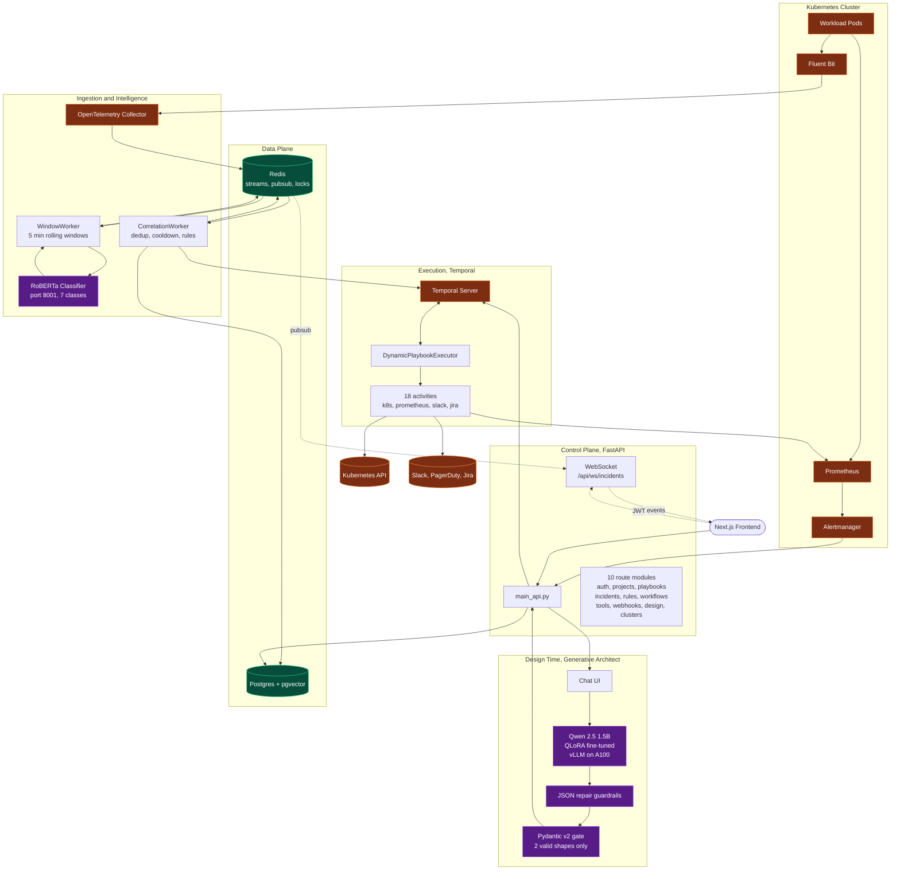
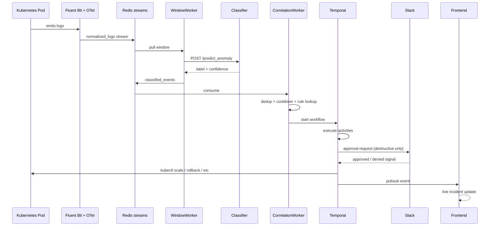

# AutoMend: from alert to action in seconds

**Zapier for MLOps & Infra.**

Most monitoring stacks stop at the alert. A pod starts thrashing, a GPU goes idle at 3 am, your drift score crosses a threshold, and a dashboard turns red. Then someone has to wake up, open five tabs, and type `kubectl` into a terminal. AutoMend is the layer that replaces "someone" with a validated, auditable remediation workflow, and only pages a human when the system isn't sure.
 You can ingest real Kubernetes logs, classify them, generate a remediation playbook from a natural language prompt, and execute it against a cluster with a human-in-the-loop gate on destructive actions.

---

## Table of contents

- [What it does](#what-it-does)
- [Architecture](#architecture)
- [Tech stack](#tech-stack)
- [Key features](#key-features)
- [Runtime flow](#runtime-flow)
- [Design decisions worth calling out](#design-decisions-worth-calling-out)
- [Repository layout](#repository-layout)
- [Running locally](#running-locally)
- [Deployment](#deployment)
- [Testing](#testing)
- [Team and contributions](#team-and-contributions)
- [Companion repository](#companion-repository)

---

## What it does

AutoMend sits between your observability stack (Grafana, Datadog, Prometheus, Alertmanager) and your infrastructure (Kubernetes, KServe). When a monitored signal crosses a threshold or a log window classifies as anomalous, the system:

1. Correlates the signal into an incident, dedups, and applies a cooldown.
2. Looks up the playbook bound to that incident type.
3. Kicks off a durable workflow in Temporal that executes the remediation steps (scale, rollback, restart, notify, page, ticket).
4. Pauses for human approval on anything destructive, routed through Slack.
5. Streams live status back to the web UI over WebSocket.

For playbook authoring, users either drag and drop nodes on a React canvas or describe the intent in natural language to a fine-tuned Qwen 2.5 model that generates the workflow JSON directly.

---

## Architecture

   
---

## Tech stack

| Layer | Tools |
|-------|-------|
| Frontend | Next.js 14 App Router, React 18, TypeScript, Tailwind, ReactFlow |
| API | FastAPI, Pydantic v2, JWT auth, WebSocket |
| Workers | Python async workers for windowing, correlation, and Temporal activities |
| Orchestration | Temporal (durable workflows, signal-based human approval) |
| ML Serving | vLLM (Qwen 2.5 1.5B Instruct, QLoRA fine-tuned, MLX-trained then fused), FastAPI (RoBERTa classifier) |
| Data | Postgres with pgvector, Redis (streams + pub/sub + dedup) |
| Observability | Prometheus, Alertmanager, Grafana, Loki, Fluent Bit, OpenTelemetry |
| Infra | Docker Compose (local), Helm + Terraform (GCP: GKE, Cloud SQL, Memorystore, Artifact Registry) |
| Training | QLoRA, MLX (Apple Silicon) / bitsandbytes (CUDA), HuggingFace, W&B sweeps |

---

## Key features

**Event-driven trigger engine.** Ingests alerts from Alertmanager and structured logs through OpenTelemetry into Redis streams. A windowed classifier runs a RoBERTa model against 5-minute windows of normalized logs to detect anomalies across 7 training classes, which are translated to 14 operational labels through a log-pattern-aware refinement shim.

**Generative Architect.** A chat interface backed by a fine-tuned Qwen 2.5 1.5B model that takes plain English and emits workflow JSON against a fixed tool registry. Every output passes through a 5-stage JSON repair pipeline for truncated or malformed responses, then through a Pydantic v2 gate with `extra="forbid"` that accepts exactly two valid shapes: a tool workflow with at least one step, or a refusal with a message and empty steps. Nothing structurally invalid reaches the executor.

**Durable orchestration.** Temporal executes playbooks as durable workflows. If a worker crashes mid-remediation, Temporal replays from the last completed activity rather than restarting the whole workflow. Destructive actions (rollback, cordon, drain, delete) route through a Slack approval activity that awaits a signal, which can pause for minutes or hours without polling.

**Human-in-the-loop governance.** Every destructive action requires explicit Slack approval. Every step emits a record to Postgres for audit. Every workflow is versioned and immutable once executed.

**Real-time UI.** Incident state, workflow progress, and approval requests stream to the frontend over JWT-authenticated WebSockets backed by Redis pub/sub.

**Production-grade infra.** Helm chart with 21 templates (API, workers, classifier, frontend, Temporal, Postgres, Redis, ingress, RBAC, secrets). Terraform modules for GCP (GKE, Cloud SQL, Memorystore, Artifact Registry, secret management). Three values files for local, GCP full, and GCP quick-start deployments.

---

## Runtime flow


---

## Repository layout

```
automend-product/
├── src/                           # Next.js frontend (App Router, ReactFlow, Tailwind)
│   ├── app/                       # Pages: login, dashboard, incidents, workflow builder
│   ├── components/                # ReactFlow nodes, config panel
│   └── lib/                       # Typed API client, auth context, spec adapters
│
├── backend/
│   ├── main_api.py                # FastAPI entrypoint (10 routers + WebSocket)
│   ├── main_window_worker.py      # 5-min rolling window classifier loop
│   ├── main_correlation_worker.py # dedup, cooldown, trigger rule lookup
│   ├── main_temporal_worker.py    # durable workflow executor
│   ├── app/
│   │   ├── api/                   # routes_auth, routes_playbooks, routes_design, etc
│   │   ├── services/              # classifier_client, architect_client, k8s_client, etc
│   │   ├── stores/                # postgres_store, redis_store
│   │   ├── temporal/              # 18 activities + DynamicPlaybookExecutor workflow
│   │   └── workers/               # window_worker, correlation_worker implementations
│   └── tests/                     # 30 test files, includes 3 e2e
│
├── inference_backend/
│   ├── ClassifierModel/           # RoBERTa serving API (lifespan + MPS/CUDA/CPU)
│   └── GeneratorModel/            # vLLM proxy with 5-stage JSON repair guardrails
│
├── infra/
│   ├── docker-compose.yml         # Full local stack (pgvector, redis, temporal, prom, grafana, loki)
│   ├── helm/automend/             # 21 Helm templates, 3 values files
│   ├── terraform/modules/         # 7 GCP modules (gke, cloud-sql, memorystore,
│   │                              #                artifact-registry, secrets, model-storage)
│   ├── prometheus/                # Scrape config + alert rules
│   └── alertmanager/              # Routing + Slack integration
│
└── crashing-*.yaml                # Demo workloads that emit realistic failure logs
```
---

## Running locally

Requires Docker Desktop with 8+ GB allocated.

```bash
git clone https://github.com/BhanuHarshaY/AutoMend-Product.git
cd AutoMend-Product/infra
docker compose up -d --build
```

This starts the full stack: Postgres with pgvector, Redis, Temporal, Temporal UI, Prometheus, Alertmanager, Loki, Grafana, the FastAPI API, the three workers, the classifier, and the frontend.

- Frontend: http://localhost:3000
- API: http://localhost:8000
- Temporal UI: http://localhost:8080
- Grafana: http://localhost:3001 (admin / admin)
- Prometheus: http://localhost:9090

To trigger a synthetic failure for demo purposes:

```bash
kubectl apply -f crashing-ml.yaml
```

That drops a pod emitting realistic CUDA out-of-memory log patterns every 2 seconds, which Fluent Bit ships up to Redis, which the WindowWorker classifies, which the CorrelationWorker binds to the GPU remediation playbook.

---

## Deployment

The system is designed to deploy to Google Kubernetes Engine. The Terraform stack provisions GKE, Cloud SQL Postgres with pgvector, Memorystore Redis, Artifact Registry, and External Secrets for GCP Secret Manager integration. The Helm chart deploys the application. See [`infra/terraform/README.md`](infra/terraform/README.md) and [`DEPLOY_GCP.md`](DEPLOY_GCP.md) for the full walkthrough.

---

## Testing

Coverage spans unit, integration, and end-to-end levels.

- **Product repo:** ~630 test functions across `backend/tests/`, `inference_backend/`, and `infra/tests/`. Three end-to-end suites: `test_e2e_full_pipeline`, `test_e2e_inference_integration`, `test_e2e_logs_to_incident`.
- **Companion data pipeline repo:** 519 tests across 6 dataset packages plus root-level combiner/integration/e2e suites.

Run the product tests:

```bash
cd backend
pytest
```

## Companion repository

Data pipelines and model training live in a separate repo: [**BhanuHarshaY/AutoMend**](https://github.com/BhanuHarshaY/AutoMend). That repo contains the Airflow DAGs for the six source datasets (Alibaba Cluster Trace, LogHub, StackOverflow MLOps, synthetic workflows, Glaive function-calling, The Stack IaC), the Track A RoBERTa training pipeline with Ray Tune + Optuna sweeps and Captum explainability, and the Track B Qwen QLoRA fine-tuning pipeline with phased evaluation, gold benchmarks, and robustness testing across 5 perturbation types.

---

