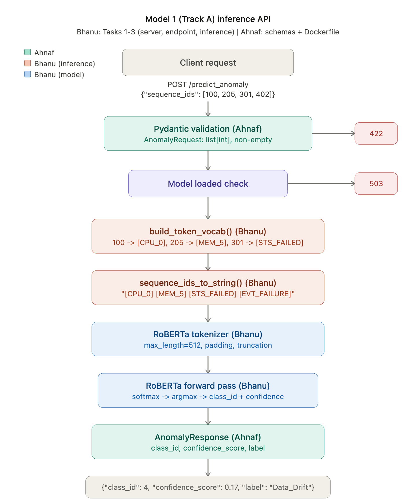

# AutoMend Backend — Track A Inference Service

FastAPI service that serves the **Track A Trigger Engine** — the RoBERTa-based 7-class anomaly classifier for the AutoMend self-healing MLOps platform.

This service handles the **classify_anomaly** step in the pipeline: it takes a 5-minute window of raw infrastructure log entries and returns a predicted anomaly class with a confidence score.

> **Note on the request contract (Phase 10.1, 2026-04-14):** previous versions of this service required the caller to pre-tokenize telemetry into integer `sequence_ids`. That contract has been retired. The service now accepts the raw log-entry list produced by the AutoMend core backend's `WindowWorker` and tokenizes internally with the stock `RobertaTokenizer`. See the core repo's `DECISIONS.md` (DECISION-019) for the rationale.

---

## Request Flow



---

## Repository Structure

```
classifierModelAPI/
├── app/
│   ├── __init__.py
│   ├── main.py              # FastAPI app, lifespan model loading, endpoints
│   ├── inference.py         # Log-body concatenation + RoBERTa forward pass
│   └── schemas/
│       ├── __init__.py
│       └── anomaly.py       # AnomalyRequest, AnomalyResponse, LABEL_NAMES
├── tests/
│   ├── __init__.py
│   ├── conftest.py          # Sample log windows + mock model/tokenizer fixtures
│   ├── test_schemas.py      # AnomalyRequest / AnomalyResponse validation
│   ├── test_inference.py    # logs_to_text + run_inference unit tests
│   ├── test_api.py          # /health + /predict_anomaly route tests
│   └── requirements-test.txt
├── models/
│   └── temp.txt             # Keeps directory tracked by git (weights are gitignored)
├── Dockerfile
├── requirements.txt
└── README.md
```

---

## What Is Implemented

### 1. FastAPI Application (`app/main.py`)

- **App factory** with a `lifespan` context manager.
- **Startup:** auto-detects device (CUDA > MPS > CPU), loads `AutoTokenizer` + `AutoModelForSequenceClassification` either from `models/` (if `config.json` is present) or `roberta-base` from the Hub (dev fallback), stores them on `app.state`, sets `eval()` + disables gradients globally.
- **Shutdown:** releases model + tokenizer references.

#### Model Loading Logic

| Condition | Behavior |
|-----------|----------|
| `models/config.json` exists | Loads from `models/` (`from_pretrained("models/")`) |
| `models/config.json` absent | Falls back to `roberta-base` from the Hub — **dev only; classifier head is randomly initialized** |

---

### 2. Inference Pipeline (`app/inference.py`)

Two functions:

#### `logs_to_text(logs, max_logs) -> str`

Takes at most `max_logs` entries, extracts each `body` field, strips blanks, and joins with `"\n"`. Non-string bodies are coerced with `str()`. Returns the concatenated string.

#### `run_inference(model, tokenizer, logs, max_logs, device) -> (int, float)`

1. Call `logs_to_text()` to get a single string from the log bodies.
2. If the string is empty (all bodies blank/missing), short-circuit to `(0, 1.0)` — class 0 ("Normal") with full confidence.
3. Tokenize with `max_length=512, padding="max_length", truncation=True, return_tensors="pt"`.
4. Forward pass under `torch.no_grad()`.
5. Softmax over logits, `argmax` for `class_id`, index back in for `confidence_score`.
6. Returns Python `(int, float)` — not tensors.

No vocabulary building, no decile buckets, no pre-encoding. The tokenizer does everything.

---

### 3. Pydantic Schemas (`app/schemas/anomaly.py`)

#### `AnomalyRequest`

Matches the core backend's `classifier_input` dict from `backend/app/workers/window_worker.py`. Extra fields are accepted and ignored (`model_config.extra = "ignore"`) so a legacy caller sending `sequence_ids` will not 422 — the field is silently dropped.

| Field | Type | Default | Validation |
|-------|------|---------|-----------|
| `entity_key` | `str` | `""` | — |
| `window_start` | `str` | `""` | — (ISO-8601 informational) |
| `window_end` | `str` | `""` | — (ISO-8601 informational) |
| `logs` | `list[dict]` | required | non-empty |
| `max_logs` | `int` | `200` | `>= 1` |
| `entity_context` | `dict` | `{}` | — (currently unused by the model) |

#### `AnomalyResponse`

Unchanged from the prior contract:

| Field | Type | Constraints |
|-------|------|------------|
| `class_id` | `int` | `0 <= class_id <= 6` |
| `confidence_score` | `float` | `0.0 <= score <= 1.0` |
| `label` | `str` | Human-readable class name |

#### `LABEL_NAMES`
```python
{
    0: "Normal",
    1: "Resource_Exhaustion",
    2: "System_Crash",
    3: "Network_Failure",
    4: "Data_Drift",
    5: "Auth_Failure",
    6: "Permission_Denied",
}
```

The core backend's `ClassifierClient` translates these 7 class names into the core's 14-label taxonomy (`failure.memory`, `degradation.latency`, etc.) via `app/services/classifier_taxonomy.py`. This service does **not** need to know about the core taxonomy.

---

## API Endpoints

### `GET /health`

Returns server and model status.

```json
{
  "status": "healthy",
  "model_loaded": true,
  "device": "mps"
}
```

### `POST /predict_anomaly`

Classifies a 5-minute log window.

**Request body:**
```json
{
  "entity_key": "prod/recommendations/reco-pod",
  "window_start": "2026-04-14T12:00:00Z",
  "window_end":   "2026-04-14T12:05:00Z",
  "logs": [
    {"body": "pod OOMKilled",            "attributes": {"namespace": "prod"}},
    {"body": "memory limit exceeded",    "attributes": {}},
    {"body": "cgroup out of memory",     "attributes": {}}
  ],
  "max_logs": 200,
  "entity_context": {"namespace": "prod", "workload": "reco-pod"}
}
```

**Response:**
```json
{
  "class_id": 1,
  "confidence_score": 0.87,
  "label": "Resource_Exhaustion"
}
```

**Error responses:**

| Code | Condition |
|------|-----------|
| `422` | `logs` is empty, missing, or `max_logs < 1` |
| `503` | Model not loaded (startup failed or still in progress) |
| `500` | Inference threw an unexpected exception |

---

## Running Locally

### Prerequisites
```bash
Python 3.10+
pip install -r requirements.txt
```

### Start the server
```bash
uvicorn app.main:app --host 0.0.0.0 --port 8000
```

### With a trained checkpoint

Place all files produced by `save_pretrained()` into `models/`:
```
models/
├── config.json           # required — triggers local load path
├── tokenizer.json
├── tokenizer_config.json
├── vocab.json
├── merges.txt
└── model.safetensors     # gitignored, add manually
```

The server detects `models/config.json` on startup and loads from `models/` automatically.

### Docker
```bash
docker build -t automend-track-a .
docker run -p 8000:8000 -v $(pwd)/models:/app/models automend-track-a
```

---

## Running Tests

```bash
pip install -r tests/requirements-test.txt
pytest tests/ -v
```

30 tests cover schema validation, log-text concatenation edge cases, the forward pass (mocked), and every route branch (200 / 422 / 500 / 503). No GPU or HuggingFace downloads needed — the API tests install mock model state directly on `app.state` and skip the lifespan startup.

---

## Integration Notes for the Main Backend

### How this service fits into the pipeline

The core backend's `WindowWorker` consumes logs from the `normalized_logs` Redis stream, buffers them into 5-minute windows, and on window close builds the `classifier_input` dict and POSTs it here via `ClassifierClient`:

```python
import httpx

response = httpx.post(
    "http://track-a-service:8000/predict_anomaly",
    json={
        "entity_key": entity_key,
        "window_start": window_start,
        "window_end": window_end,
        "logs": logs[:200],
        "max_logs": 200,
        "entity_context": entity_context,
    },
    timeout=10.0,
)
result = response.json()
# {"class_id": 1, "confidence_score": 0.87, "label": "Resource_Exhaustion"}
```

### Confidence gate

The main backend applies the confidence gate via `settings.classifier_confidence_threshold`. This service returns the raw score and does not enforce a gate.

### Taxonomy translation

The core's `ClassifierClient` translates the 7-class output into the core's 14-label taxonomy (e.g., `Resource_Exhaustion` + "CUDA" in the logs → `failure.gpu`). This service stays in its 7-class world — retraining the model later with a different class set only changes the mapping table on the core side.

---

## What Is NOT Implemented Here

- Celery / worker wiring (core owns that)
- Track B (Qwen2.5 workflow generator) — separate service
- Debounce / cooldown / dedup (core + Redis)
- Confidence gate enforcement (core)
- Human approvals, audit trail, auth (core)
- Tool-registry taxonomy mapping (core)
